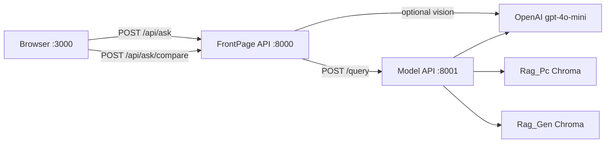

# TerraMind — Technical Project Overview

This document describes how the TerraMind agriculture assistant works end-to-end: what the user sees in the web app, which tools and models power it, how knowledge is stored, and how features such as **compare mode**, **image upload**, and **conversation history** fit together.

For local setup, see [FrontPage/RUN_LOCALLY.md](FrontPage/RUN_LOCALLY.md). Commands use **`<repo-root>`** for your clone path (not a fixed machine path).

---

## 1. What the user gets

TerraMind is a **chat-style web assistant** for farmers and agronomy staff. From the browser, users can:

- Ask questions in **any language** (English and Arabic are first-class; RTL layout is supported).
- Choose **one of three AI modes** from a dropdown (top right), similar to model pickers in ChatGPT.
- Turn on **Compare** to send the **same question to all three modes** and read answers side-by-side in three columns.
- **Upload a plant/crop photo** so vision analysis is included in every mode’s context.
- Browse **past conversations** in the sidebar; chats **persist in the browser** across refresh.
- Toggle **Show sources** to see which catalog rows or documents grounded a RAG answer.
- Switch **dark / light** theme.

The product goal is to compare **retrieval-grounded** answers (product catalog + general docs) against a **plain LLM baseline** on identical questions.

---

## 2. High-level architecture

Three processes run in development:

| Layer | Port | Technology | Role |
|-------|------|------------|------|
| **React UI** | 3000 | Vite + React (`App.jsx`) | Chat UI, sessions, model picker, compare layout |
| **FrontPage API** | 8000 | FastAPI (`FrontPage/app/`) | Auth-less BFF: vision pre-processing, proxy to model API, mock fallback |
| **Model API** | 8001 | FastAPI (`rag_api.py`) | Routes to `models/` → `Rag_Pc.py` / `Rag_Gen.py` / `base_llm` |



Vite proxies `/api/*` to `http://localhost:8000`, so the frontend only talks to one origin during dev.

---

## 3. Tools and libraries

### Frontend

| Tool | Purpose |
|------|---------|
| **React 18** | Single-page chat UI |
| **Vite** | Dev server, HMR, `/api` proxy |
| **Plain CSS-in-JSX** | Theming (dark/light), layout, compare grid |
| **localStorage** | Session persistence (`terramind_sessions_v1`) |
| **Fetch API** | `POST /api/ask`, `POST /api/ask/compare`, `GET /api/models` |

### Backends

| Tool | Purpose |
|------|---------|
| **FastAPI** | HTTP APIs on 8000 and 8001 |
| **Pydantic** | Request/response schemas |
| **httpx** | FrontPage → model API async HTTP |
| **python-dotenv** | API keys and URLs from `.env` |

### AI / RAG stack

| Tool | Purpose |
|------|---------|
| **OpenAI API** | Chat (`gpt-4o-mini`), embeddings (`text-embedding-3-small`), vision |
| **LangChain** | Prompt templates, `ChatOpenAI`, message types |
| **langchain-chroma** | Vector store wrapper |
| **ChromaDB** | On-disk vector indexes under `vectorstore/` |
| **pandas** | Excel product catalog loading (`Rag_Pc.py`) |

### Data files

| Location | Content |
|----------|---------|
| `data/raw/text/ProductCatalog(En).xlsx` | Client product catalog (RAG mode 1) |
| `data/raw/text/Pest_Management_FAO.md` | General agriculture text (RAG mode 2) |
| `vectorstore/chroma/` | General document embeddings |
| `vectorstore/chroma_products/` | Product catalog embeddings |
| `FrontPage/frontend-react/public/TM_Logo.png` | Logo served to the UI (not repo root copy) |

---

## 4. The three models (modes)

All modes share the same **response shape** (`answer`, `sources`, `confidence`, `retrieved_chunks`) so the UI and APIs stay uniform. Implementation lives under `models/` — **one Python file per mode**.

| UI name | ID | Module | Knowledge | LLM |
|---------|-----|--------|-----------|-----|
| **Product Catalog RAG** | `product_rag` | `models/product_rag.py` → `Rag_Pc.py` | Excel rows embedded in Chroma | `gpt-4o-mini` |
| **Agriculture Knowledge RAG** | `general_rag` | `models/general_rag.py` → `Rag_Gen.py` | FAO / IPM markdown in Chroma | `gpt-4o-mini` |
| **Base LLM** | `base_llm` | `models/base_llm.py` | None (no retrieval) | `gpt-4o-mini` |

### Product Catalog RAG (`product_rag`)

1. Load product rows from Excel; each product becomes searchable text (name, dosage, manual, crops, etc.).
2. **Embed** chunks with `text-embedding-3-small` and store in `vectorstore/chroma_products/`.
3. On a question: **similarity search** → top-k chunks → prompt with **context + question**.
4. The model must answer **only from retrieved context** (reduces invented dosages).

Best for: *“How do I use product X?”*, *“What crops is Y registered for?”*

### Agriculture Knowledge RAG (`general_rag`)

Same pipeline as above, but documents are **general IPM / pest management** text (e.g. FAO markdown), index at `vectorstore/chroma/`.

Best for: *integrated pest management*, *disease principles*, content **not** in the product sheet.

### Base LLM (`base_llm`)

Direct **system prompt + chat messages** to OpenAI with **no vector lookup**. Used as a **comparison baseline** — may give generic advice and must not invent catalog-specific label data.

Prompt rules explicitly state there is **no product catalog** in this mode.

### Model registry

`models/__init__.py` exposes:

- `list_models()` — for `GET /models` and the UI dropdown  
- `run_model(model_id, question, history, …)` — dispatches to the correct backend  
- `resolve_image_analysis()` — one vision call shared across modes when an image is uploaded  

---

## 5. How information is stored

### 5.1 Vector indexes (long-term knowledge)

| Index path | Built by | Source data |
|------------|----------|-------------|
| `vectorstore/chroma_products/` | `python Rag_Pc.py --reset` | Product Excel |
| `vectorstore/chroma/` | `python Rag_Gen.py --reset` | `Pest_Management_FAO.md` (and paths in `Rag_Gen.py`) |

Indexes are **persistent on disk**. Rebuild when Excel or documents change. At runtime, `get_product_db()` / `get_general_db()` load existing Chroma collections if present.

### 5.2 In-memory server log (optional)

`FrontPage/app/routers/history.py` keeps a simple **global list** of recent Q&A snippets for `GET /api/history`. This is **not** per-user session storage; it is a dev-friendly audit log.

### 5.3 Browser session storage (conversation UI)

The React app saves **sidebar sessions** to:

```text
localStorage key: terramind_sessions_v1
```

Each session has: `id`, `name`, `messages[]`, `ts`. User and bot text are stored; **image preview blobs are stripped** on save (only text survives refresh).

On every message send, the client builds a **`history` array** (last 20 turns) and sends it in the JSON body so models can see prior context in **that chat**.

### 5.4 What is sent to the model on each turn

```json
{
  "question": "current user message",
  "model": "product_rag",
  "history": [
    { "role": "user", "content": "..." },
    { "role": "assistant", "content": "..." }
  ],
  "image_base64": "optional",
  "image_mime": "image/jpeg"
}
```

**Conversation memory wiring:**

- **Base LLM:** history → LangChain `HumanMessage` / `AIMessage` chain (last 10 turns).  
- **Both RAG modes:** `models/conversation.py` prepends a **“Previous conversation”** block to the question before retrieval and generation.  
- **Compare mode:** prior compare results are folded into history as one assistant message (all three answers concatenated).

---

## 6. Compare mode

**UI:** “Compare” button next to the image attach control. When enabled:

- The model dropdown is disabled (all three run automatically).
- `POST /api/ask/compare` → FrontPage → `POST /query/compare` on port 8001.
- The model API runs **three backends in parallel** (`asyncio.gather`).
- **Vision runs once**; the same `image_analysis` text is passed to each model (no triple vision cost).

**UI layout:** One user bubble, then a **3-column grid**. Each column has:

- Header: model display name + latency  
- Body: answer text (or error)  
- Footer (optional): source chips if “Show sources” is on  

Chat width expands (~1280px) so columns remain readable.

---

## 7. Image upload and vision

### User flow

1. User attaches an image (file picker or drag-and-drop).  
2. Frontend sends `image_base64` + `image_mime` with the question.  
3. **FrontPage** (`rag_service._analyze_image`) or **model API** (`models/vision.py`) calls **gpt-4o-mini** with the image.  
4. Vision output is agronomy-focused: symptoms, affected parts, severity, initial advice.  
5. That text is injected into **all three** backends via `models/image_context.py` and `build_prompt_question()`.

### Configuration

If `OPENAI_API_KEY` is set (`<repo-root>/.env` or `<repo-root>/FrontPage/.env`), vision defaults to **OpenAI + gpt-4o-mini** without extra env vars. Optional overrides: `VISION_PROVIDER`, `VISION_API_KEY`, `VISION_MODEL`.

### Logo asset (separate from chat vision)

The header logo is a static file:

```text
FrontPage/frontend-react/public/TM_Logo.png
```

Referenced in `App.jsx` as `/TM_Logo.png?v=2` (version query busts browser cache). Replacing the logo requires updating **this** `public/` file, not only `TM_Logo.png` at `<repo-root>`.

---

## 8. End-to-end request flows

### Single model (default)

```text
1. User submits → App.jsx POST /api/ask { question, model, history, image? }
2. FrontPage: detect language; analyze image if present
3. FrontPage POST http://localhost:8001/query { question, model, history, image_analysis?, image_base64? }
4. rag_api → run_model() → product_rag | general_rag | base_llm
5. Response → sources, answer, latency → UI renders bot message
6. localStorage updated with new messages
```

### Compare all models

```text
1. User enables Compare → POST /api/ask/compare
2. FrontPage resolves vision once → POST /query/compare
3. rag_api runs three run_model() calls in parallel (shared image_analysis)
4. UI replaces loading skeleton with three column cards
```

---

## 9. Repository layout (current MVP)

```text
TerraMind/
├── docs/
│   └── PROJECT_OVERVIEW.md      ← this file
├── models/                      # Unified model adapters
│   ├── __init__.py              # Registry + run_model()
│   ├── product_rag.py
│   ├── general_rag.py
│   ├── base_llm.py
│   ├── vision.py                # gpt-4o-mini image analysis
│   ├── conversation.py          # History → prompt text
│   └── image_context.py
├── Rag_Pc.py                    # Product Excel → Chroma + RAG
├── Rag_Gen.py                   # General docs → Chroma + RAG
├── rag_api.py                   # Model API :8001
├── data/raw/text/               # Source documents
├── vectorstore/                 # Chroma persistence (gitignored)
├── FrontPage/
│   ├── app/                     # FastAPI :8000
│   │   ├── routers/ask.py       # /api/ask, /api/ask/compare
│   │   ├── routers/models.py    # /api/models
│   │   ├── services/rag_service.py
│   │   └── schemas/ask.py
│   ├── frontend-react/          # Vite + React :3000
│   │   ├── src/App.jsx
│   │   └── public/TM_Logo.png
│   ├── ARCHITECTURE.md          # Shorter architecture summary
│   └── RUN_LOCALLY.md
├── src/                         # Earlier bootcamp scripts (Phase 1)
└── scripts/                     # Ingestion CLI utilities
```

---

## 10. API reference (web stack)

### FrontPage — port 8000

| Method | Path | Description |
|--------|------|-------------|
| POST | `/api/ask` | Single model; body includes `model`, `history`, optional image |
| POST | `/api/ask/compare` | All three models in parallel |
| GET | `/api/models` | List modes for dropdown (proxies 8001 or fallback list) |
| GET | `/api/health` | Backend mode (mock / RAG / error) |
| GET | `/api/history` | Global question log (in-memory) |
| DELETE | `/api/history` | Clear global log |

### Model API — port 8001

| Method | Path | Description |
|--------|------|-------------|
| POST | `/query` | Single model |
| POST | `/query/compare` | Parallel compare |
| GET | `/models` | Registry metadata |
| GET | `/health` | Vector counts per index |

---

## 11. Configuration cheat sheet

| Variable | Where | Purpose |
|----------|-------|---------|
| `OPENAI_API_KEY` | `.env` (root or FrontPage) | Embeddings, chat, vision |
| `USE_MOCK` | `FrontPage/.env` | Canned answers (no 8001) |
| `RAG_SERVICE_URL` | `FrontPage/.env` | Default `http://localhost:8001/query` |
| `REQUEST_TIMEOUT` | `FrontPage/.env` | HTTP timeout to model API |

Default chat/vision model: **`gpt-4o-mini`** in `Rag_Pc.py`, `Rag_Gen.py`, `models/base_llm.py`, `models/vision.py`.

---

## 12. Design choices (why it is built this way)

- **Two FastAPI layers:** FrontPage can add CORS, vision, mocks, and stable `/api` for the UI without reloading heavy Chroma indexes on every UI deploy.  
- **One folder per model:** Easy to swap Excel vs PDF pipelines while keeping the same HTTP contract.  
- **Compare + baseline LLM:** Supports bootcamp evaluation — same question, measured difference between RAG and non-RAG.  
- **localStorage sessions:** Simple MVP without accounts or a database; good for demos and single-machine use.  
- **Shared vision analysis:** Cost control and fair comparison — all modes see the **same** image description.

---

## 13. Related documents

| Document | Audience |
|----------|----------|
| [FrontPage/RUN_LOCALLY.md](../FrontPage/RUN_LOCALLY.md) | Step-by-step terminals and ports |
| [FrontPage/ARCHITECTURE.md](../FrontPage/ARCHITECTURE.md) | Compact architecture + diagrams |
| [FrontPage/README.md](../FrontPage/README.md) | FrontPage quick start and API examples |
| [README.md](../README.md) | Repo root index and index build commands |

---

*Last updated to reflect: three-model picker, compare mode, gpt-4o-mini defaults, image vision for all modes, and localStorage session history.*
