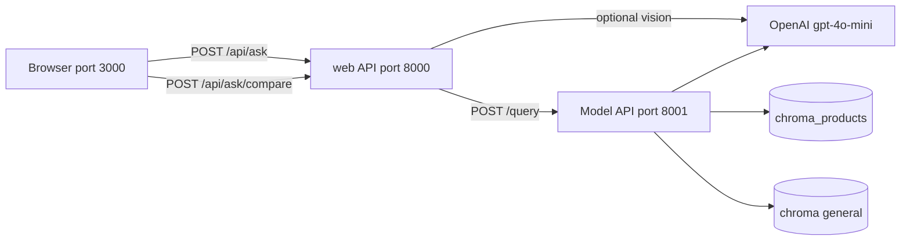

# TerraMind — Technical Project Overview

This document describes how the TerraMind agriculture assistant works end-to-end: what the user sees in the web app, which tools and models power it, how knowledge is stored, and how features such as **compare mode**, **image upload**, and **conversation history** fit together.

For local setup, see [web/RUN_LOCALLY.md](web/RUN_LOCALLY.md). Commands use **`<repo-root>`** for your clone path (not a fixed machine path).

For **system architecture only** (topology, services, RAG boundaries, API contracts), see **[docs/SYSTEM_ARCHITECTURE.md](docs/SYSTEM_ARCHITECTURE.md)**.

---

## 1. What the user gets

TerraMind is a **chat-style web assistant** for farmers and agronomy staff. From the browser, users can:

- Ask questions in **any language** (English and Arabic are first-class; RTL layout is supported).
- Choose **one of four AI modes** from a dropdown (top right), similar to model pickers in ChatGPT. **Advisory** is not listed by default.
- Turn on **Compare** to send the **same question to all three RAG/LLM backends** and read answers side-by-side in three columns.
- See answers **stream in** with retrieval/routing status lines, then token-by-token generation (single-message chat).
- **Upload a plant/crop photo** so vision analysis is included in every mode’s context.
- Use **voice input** from the composer mic button (browser speech-to-text) instead of typing.
- Browse **past conversations** in the sidebar; chats **persist in the browser** across refresh.
- Toggle **Show sources** to see which catalog rows or documents grounded a RAG answer.
- Switch **dark / light** theme.

The product goal is to compare **retrieval-grounded** answers (product catalog + general docs) against a **plain LLM baseline** on identical questions.

---

## 2. High-level architecture

Three processes run in development:

| Layer             | Port | Technology                                   | Role                                                                    |
| ----------------- | ---- | -------------------------------------------- | ----------------------------------------------------------------------- |
| **React UI**      | 3000 | Vite + React (`App.jsx`)                     | Chat UI, sessions, model picker, compare layout                         |
| **web API** | 8000 | FastAPI (`web/app/`)                   | Auth-less BFF: vision pre-processing, proxy to model API, mock fallback |
| **Model API**     | 8001 | FastAPI (`core.api.app`) | `core.models` → auto / product / general / base LLM                |



Vite proxies `/api/*` to `http://localhost:8000`, so the frontend only talks to one origin during dev.

---

## 3. Tools and libraries

### Frontend

| Tool                         | Purpose                                                                                   |
| ---------------------------- | ----------------------------------------------------------------------------------------- |
| **React 18**                 | Single-page chat UI                                                                       |
| **Vite**                     | Dev server, HMR, `/api` proxy                                                             |
| **Plain CSS-in-JSX**         | Theming (dark/light), layout, compare grid                                                |
| **localStorage**             | Session persistence (`terramind_sessions_v1`)                                             |
| **Fetch API**                | `POST /api/ask/stream`, `/api/ask/advisory/stream`, `/api/ask/compare`, `GET /api/models` |
| **Web Speech API**           | Composer mic speech-to-text (`SpeechRecognition` / `webkitSpeechRecognition`)             |
| **MediaDevices / Web Audio** | Mic device list and live voice level meter (`getUserMedia`, `AudioContext`)               |

### Backends

| Tool              | Purpose                          |
| ----------------- | -------------------------------- |
| **FastAPI**       | HTTP APIs on 8000 and 8001       |
| **Pydantic**      | Request/response schemas         |
| **httpx**         | web → model API async HTTP |
| **python-dotenv** | API keys and URLs from `.env`    |

### AI / RAG stack

| Tool                 | Purpose                                                             |
| -------------------- | ------------------------------------------------------------------- |
| **OpenAI API**       | Chat (`gpt-4o-mini`), embeddings (`text-embedding-3-small`), vision |
| **LangChain**        | Prompt templates, `ChatOpenAI`, message types                       |
| **langchain-chroma** | Vector store wrapper                                                |
| **ChromaDB**         | On-disk vector indexes under `vectorstore/`                         |
| **pandas**           | Excel product catalog loading (`core/rag/product/`)            |

### Data files

| Location                                                         | Content                                                                                              |
| ---------------------------------------------------------------- | ---------------------------------------------------------------------------------------------------- |
| `data/raw/product_catalog/translated/product_catalog_en.xlsx`    | Translated client product catalog used by Product RAG                                                |
| `data/raw/product_catalog/translated/product_categories_en.xlsx` | Translated product category sheet joined during Product RAG indexing                                 |
| `data/raw/documents/`                                            | General agriculture PDFs (RAG mode 2) — see [docs/GENERAL_RAG_CORPUS.md](docs/GENERAL_RAG_CORPUS.md) |
| `vectorstore/chroma/`                                            | General document embeddings                                                                          |
| `vectorstore/chroma_products/`                                   | Product catalog embeddings                                                                           |
| `web/frontend-react/public/TM_Logo.png`                    | Logo served to the UI (not repo root copy)                                                           |

---

## 4. Models (modes)

All modes share the same **response shape** (`answer`, `sources`, `confidence`, `retrieval_score`, `retrieved_chunks`, …). Implementation lives under **`core/models/`**.

| UI name                       | ID            | Module                                      | Knowledge                                                    | LLM           |
| ----------------------------- | ------------- | ------------------------------------------- | ------------------------------------------------------------ | ------------- |
| **Auto (recommended)**        | `auto_rag`    | `auto_rag.py` + `router.py`                 | Routes to product, general, or **base LLM** (meta questions) | `gpt-4o-mini` |
| **Agriculture Knowledge RAG** | `general_rag` | `general_rag.py` → `core/rag/general/` | Public PDFs in `data/raw/documents/`                         | `gpt-4o-mini` |
| **Product Catalog RAG**       | `product_rag` | `product_rag.py` → `core/rag/product/` | Excel catalog in Chroma                                      | `gpt-4o-mini` |
| **Base LLM**                  | `base_llm`    | `base_llm.py`                               | None (no retrieval)                                          | `gpt-4o-mini` |
| **Advisory** (hidden UI)      | `advisory`    | `run_advisory()` in `__init__.py`           | General then product (meta questions skip RAG)               | `gpt-4o-mini` |

### Product Catalog RAG (`product_rag`)

1. Load product rows from Excel; each product becomes searchable text (name, dosage, manual, crops, etc.).
2. **Embed** chunks with `text-embedding-3-small` and store in `vectorstore/chroma_products/`.
3. On a question: **similarity search** → top-k chunks → prompt with **context + question**.
4. The model must answer **only from retrieved context** (reduces invented dosages).

Best for: _“How do I use product X?”_, _“What crops is Y registered for?”_

### Agriculture Knowledge RAG (`general_rag`)

The General Agriculture RAG is built from **trusted public agriculture references** covering good agricultural practices (GAP), soil health, cover crops, crop rotation, integrated pest management (IPM), and pesticide stewardship. This gives TerraMind a **broader knowledge layer**; **Product RAG** stays responsible for **company-specific** product labels and catalog data.

Sources live in **`data/raw/documents/`** (PDFs; optional `.md`/`.txt`). The index is at `vectorstore/chroma/`. See **[docs/GENERAL_RAG_CORPUS.md](docs/GENERAL_RAG_CORPUS.md)**.

Best for: _IPM_, _soil and rotation_, _disease principles_, _GAP_, content **not** in the product sheet.

### Base LLM (`base_llm`)

Direct **system prompt + chat messages** to OpenAI with **no vector lookup**. Used as a **comparison baseline** — may give generic advice and must not invent catalog-specific label data.

Prompt rules explicitly state there is **no product catalog** in this mode. **Auto mode** also routes here for conversational questions (_who are you_, _hello_, _what can you do_, etc.) so those answers do not hit RAG indexes.

### Advisory (hidden — General + Product)

**Not in the public model dropdown.** Unlock in the UI by clicking the TerraMind logo **6 times** within **2.5 seconds** (sidebar, header, or welcome-screen logo). Unlock state is stored in **`sessionStorage`** (`terramind_advisory_unlocked_v1`) for the current browser tab.

When unlocked, **Advisory (General + Product)** appears in the picker and runs:

1. **General RAG** — public agriculture guidance
2. **Product RAG** — catalog recommendation informed by the general summary

**Meta / identity questions** (_who are you_, greetings) return a short TerraMind intro **without** vector retrieval or catalog lookup.

Backend: `POST /api/ask/advisory/stream` (UI default) or `/query/advisory` on port 8001.

### Model registry

`core/models/__init__.py` exposes:

- `list_models()` — for `GET /models` and the UI dropdown
- `run_model(model_id, question, history, …)` — dispatches to the correct backend
- `resolve_image_analysis()` — one vision call shared across modes when an image is uploaded

**Auto RAG (default):** `router.py` picks **product RAG**, **general RAG**, or **base LLM** per question. Meta/conversational questions skip retrieval and use base LLM. The UI shows a **“Using …”** hint under the picker (`routed_to`). **Show scores** for confidence + retrieval match when RAG ran.

**Streaming (single-message chat):** the UI calls `POST /api/ask/stream` (or `/api/ask/advisory/stream`). The server emits **NDJSON** lines: `status` (retrieval/routing progress), `token` (answer chunks), then `done` (sources, scores, latency). Compare mode still uses non-streaming JSON.

---

## 5. How information is stored

### 5.1 Vector indexes (long-term knowledge)

| Index path                     | Built by                                      | Source data                                  |
| ------------------------------ | --------------------------------------------- | -------------------------------------------- |
| `vectorstore/chroma_products/` | `python -m core.rag.product.cli --reset` | Product Excel                                |
| `vectorstore/chroma/`          | `python -m core.rag.general.cli --reset` | `data/raw/documents/*.pdf` (+ optional text) |

Indexes are **persistent on disk**. Rebuild when Excel or documents change. At runtime, `get_product_db()` / `get_general_db()` load existing Chroma collections if present.

### 5.2 In-memory server log (optional)

`web/app/routers/history.py` keeps a simple **global list** of recent Q&A snippets for `GET /api/history`. This is **not** per-user session storage; it is a dev-friendly audit log.

### 5.3 Browser session storage (conversation UI)

The React app saves **sidebar sessions** to:

```text
localStorage key: terramind_sessions_v1
```

Each session has: `id`, `name`, `messages[]`, `ts`. User and bot text are stored; **image preview blobs are stripped** on save (only text survives refresh).

Advisory unlock (hidden mode) uses a separate **`sessionStorage`** key: `terramind_advisory_unlocked_v1`.

On every message send, the client builds a **`history` array** (last 20 turns) and sends it in the JSON body so models can see prior context in **that chat**.

### 5.4 What is sent to the model on each turn

```json
{
  "question": "current user message",
  "model": "product_rag",
  "history": [
    { "role": "user", "content": "..." },
    { "role": "assistant", "content": "..." }
  ],
  "image_base64": "optional",
  "image_mime": "image/jpeg"
}
```

**Conversation memory wiring:**

- **Base LLM:** history → LangChain `HumanMessage` / `AIMessage` chain (last 10 turns).
- **Both RAG modes:** `models/conversation.py` prepends a **“Previous conversation”** block to the question before retrieval and generation.
- **Compare mode:** prior compare results are folded into history as one assistant message (all three answers concatenated).

---

## 6. Compare mode

**UI:** “Compare” button next to the image attach control. When enabled:

- The model dropdown is disabled (all three run automatically).
- `POST /api/ask/compare` → web → `POST /query/compare` on port 8001.
- The model API runs **three backends in parallel** (`asyncio.gather`).
- **Vision runs once**; the same `image_analysis` text is passed to each model (no triple vision cost).

**UI layout:** One user bubble, then a **3-column grid**. Each column has:

- Header: model display name + latency
- Body: answer text (or error)
- Footer (optional): source chips if “Show sources” is on

Chat width expands (~1280px) so columns remain readable.

---

## 7. Image upload and vision

### User flow

1. User attaches an image (file picker or drag-and-drop).
2. Frontend sends `image_base64` + `image_mime` with the question.
3. **web** (`rag_service._analyze_image`) or **model API** (`models/vision.py`) calls **gpt-4o-mini** with the image.
4. Vision output is agronomy-focused: symptoms, affected parts, severity, initial advice.
5. That text is injected into **all three** backends via `models/image_context.py` and `build_prompt_question()`.

### Configuration

If `OPENAI_API_KEY` is set (`<repo-root>/.env` or `<repo-root>/web/.env`), vision defaults to **OpenAI + gpt-4o-mini** without extra env vars. Optional overrides: `VISION_PROVIDER`, `VISION_API_KEY`, `VISION_MODEL`.

### Logo asset (separate from chat vision)

The header logo is a static file:

```text
web/frontend-react/public/TM_Logo.png
```

Referenced in `App.jsx` as `/TM_Logo.png?v=2` (version query busts browser cache). Replacing the logo requires updating **this** `public/` file, not only `TM_Logo.png` at `<repo-root>`.

---

## 8. End-to-end request flows

### Single model (default — streaming)

```text
1. User submits → App.jsx POST /api/ask/stream { question, model, history, image? }
2. UI adds a streaming bot placeholder (status line + empty answer)
3. web: detect language; analyze image if present
4. web proxies NDJSON from http://localhost:8001/query/stream (or /query/advisory/stream)
5. Events: status → token(s) → done (sources, routed_to, latency)
6. core.models.streaming → run_model path (auto / product / general / base) or run_advisory
7. UI finalizes bot message; localStorage session update
```

Non-streaming **`POST /api/ask`** and **`POST /query`** remain available for scripts and tests.

### Compare all models

```text
1. User enables Compare → POST /api/ask/compare
2. web resolves vision once → POST /query/compare
3. the model API runs three `run_model()` calls in parallel (shared image_analysis)
4. UI replaces loading skeleton with three column cards
```

---

## 9. Repository layout (current MVP)

```text
TerraMind/
├── PROJECT_OVERVIEW.md          ← this file
├── docs/                        # Developer docs (not RAG corpus)
├── core/
│   ├── api/app.py               # Model API :8001
│   ├── models/                  # auto, product, general, base, vision, router
│   └── rag/general|product/     # General complete; product package pipeline
├── run_dev.py                   # Dev launcher (3 services)
├── data/                        # See data/README.md
├── vectorstore/                 # Chroma (gitignored)
├── web/                         # :8000 API + :3000 React
├── scripts/eval_general_rag.py
└── tests/
```

---

## 10. API reference (web stack)

### web — port 8000

| Method | Path                       | Description                                                |
| ------ | -------------------------- | ---------------------------------------------------------- |
| POST   | `/api/ask`                 | Single model (full JSON response; legacy/scripts)          |
| POST   | `/api/ask/stream`          | **Default UI path** — NDJSON stream (status, tokens, done) |
| POST   | `/api/ask/advisory`        | General + product sequence (JSON)                          |
| POST   | `/api/ask/advisory/stream` | Advisory NDJSON stream (hidden UI mode)                    |
| POST   | `/api/ask/compare`         | Product, general, base LLM in parallel                     |
| GET    | `/api/models`              | List modes for dropdown (proxies 8001 or fallback list)    |
| GET    | `/api/health`              | Backend mode (mock / RAG / error)                          |
| GET    | `/api/history`             | Global question log (in-memory)                            |
| DELETE | `/api/history`             | Clear global log                                           |

### Model API — port 8001

| Method | Path                     | Description                                |
| ------ | ------------------------ | ------------------------------------------ |
| POST   | `/query`                 | Single model (`routed_to` when `auto_rag`) |
| POST   | `/query/stream`          | Single model NDJSON stream                 |
| POST   | `/query/advisory`        | General then product                       |
| POST   | `/query/advisory/stream` | Advisory NDJSON stream                     |
| POST   | `/query/compare`         | Parallel compare (3 fixed backends)        |
| GET    | `/models`                | Registry metadata                          |
| GET    | `/health`                | Vector counts per index                    |

---

## 11. Configuration cheat sheet

| Variable          | Where                      | Purpose                               |
| ----------------- | -------------------------- | ------------------------------------- |
| `OPENAI_API_KEY`  | `.env` or `web/.env` | Embeddings, chat, vision              |
| `USE_MOCK`        | `web/.env`           | Canned answers (no 8001)              |
| `RAG_SERVICE_URL` | `web/.env`           | Default `http://localhost:8001/query` |
| `REQUEST_TIMEOUT` | `web/.env`           | HTTP timeout to model API             |

Default chat/vision model: **`gpt-4o-mini`** in `core/rag/product/`, `core/rag/general/`, `core/models/base_llm.py`, `core/models/vision.py`.

---

## 12. Design choices (why it is built this way)

- **Two FastAPI layers:** web can add CORS, vision, mocks, and stable `/api` for the UI without reloading heavy Chroma indexes on every UI deploy.
- **One folder per model:** Easy to swap Excel vs PDF pipelines while keeping the same HTTP contract.
- **Compare + baseline LLM:** Supports bootcamp evaluation — same question, measured difference between RAG and non-RAG.
- **localStorage sessions:** Simple MVP without accounts or a database; good for demos and single-machine use.
- **Shared vision analysis:** Cost control and fair comparison — all modes see the **same** image description.

---

## 13. Related documents

| Document                                                | Audience                                        |
| ------------------------------------------------------- | ----------------------------------------------- |
| [web/RUN_LOCALLY.md](web/RUN_LOCALLY.md)                | Step-by-step terminals and ports                |
| [docs/PROJECT_STATUS.md](docs/PROJECT_STATUS.md)        | Shipped work, legacy artifacts, remaining tasks |
| [web/README.md](web/README.md)                          | web quick start and API examples                |
| [README.md](README.md)                                  | Repo root index and index build commands        |

---

_Last updated: June 2026 — Auto routes meta questions to base LLM; streaming chat; hidden Advisory (6× logo unlock)._
