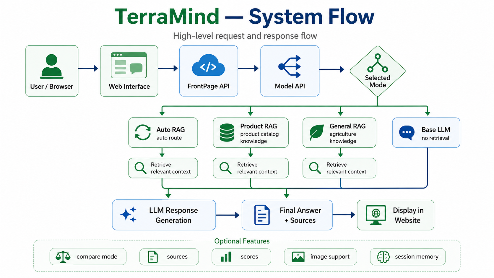

<div align="center">
  
</div>

# TerraMind

Agriculture support assistant with **Auto RAG** (default), manual product/general RAG, base LLM baseline, and advisory mode — plus a **React chat UI** with compare view, image upload, retrieval scores, and saved conversations.

---

## Documentation

| Document | Description |
|----------|-------------|
| **[docs/README.md](docs/README.md)** | Index of all `docs/` files |
| **[docs/PROJECT_STATUS.md](docs/PROJECT_STATUS.md)** | **Status & history** — shipped work, remaining tasks, legacy/removed artifacts |
| **[PROJECT_OVERVIEW.md](PROJECT_OVERVIEW.md)** | **Main guide** — features, models, storage, compare, images, APIs |
| **[docs/SYSTEM_ARCHITECTURE.md](docs/SYSTEM_ARCHITECTURE.md)** | Runtime topology and RAG boundaries |
| **[docs/FILE_MAP_AND_PIPELINE.md](docs/FILE_MAP_AND_PIPELINE.md)** | File-by-file map and request pipelines |
| **[docs/GENERAL_RAG_CORPUS.md](docs/GENERAL_RAG_CORPUS.md)** | General RAG PDF corpus and rebuild |
| **[docs/GENERAL_RAG_EVAL.md](docs/GENERAL_RAG_EVAL.md)** | Retrieval eval runbook |
| **[docs/GENERAL_RAG_VALIDATION_REPORT.md](docs/GENERAL_RAG_VALIDATION_REPORT.md)** | May 2026 validation baseline (20/20) |
| **[data/README.md](data/README.md)** | Data folders — tracked vs gitignored |
| **[terramind/README.md](terramind/README.md)** | Backend package layout |
| **[FrontPage/RUN_LOCALLY.md](FrontPage/RUN_LOCALLY.md)** | Run all three services (ports, env) |
| **[FrontPage/README.md](FrontPage/README.md)** | FrontPage API quick reference |

---


---

## Project Architecture

<div align="center">
  
</div>

<p align="center"><em>High-level request flow. Ports, services, and RAG boundaries: <a href="docs/SYSTEM_ARCHITECTURE.md">docs/SYSTEM_ARCHITECTURE.md</a>.</em></p>

---

## Quick start (web MVP)

**Paths:** `<repo-root>` = your TerraMind clone (folder with `terramind/`, `Rag_Pc.py`, `run_dev.py`, and `FrontPage/`). See [FrontPage/RUN_LOCALLY.md](FrontPage/RUN_LOCALLY.md) for full steps.

### 1. Environment

```powershell
cd <repo-root>
conda create -n terramind python=3.11 -y
conda activate terramind
pip install -r requirements.txt
# optional: pip install -r requirements-dev.txt
```

Set `OPENAI_API_KEY` in `<repo-root>/.env` or `FrontPage/.env`.

### 2. Build vector indexes (once)

```powershell
cd <repo-root>
python Rag_Pc.py --reset
python -m terramind.rag.general.cli --reset   # required after chunking/loader changes
```

### 3. Run the app

**One command:**

```powershell
cd <repo-root>
conda activate terramind
python run_dev.py
```

**Or three terminals** — see [FrontPage/RUN_LOCALLY.md](FrontPage/RUN_LOCALLY.md).

Open **http://localhost:3000**.

---

## Models (picker order)

| Mode | ID | Knowledge source |
|------|-----|------------------|
| Auto (recommended) | `auto_rag` | Router picks product or general RAG per question |
| Agriculture Knowledge RAG | `general_rag` | Public refs in `data/raw/documents/` (IPM, GAP, soil health, pesticides) |
| Product Catalog RAG | `product_rag` | Client Excel (`ProductCatalog(En).xlsx`) |
| Base LLM | `base_llm` | No retrieval — OpenAI only |
| Advisory (UI) | `advisory` | General then product in one answer (`/query/advisory`) |

**General vs product:** The General Agriculture RAG uses trusted public references (good agricultural practices, soil health, cover crops, crop rotation, integrated pest management). The Product RAG handles **company-specific** catalog information only. Details: [docs/GENERAL_RAG_CORPUS.md](docs/GENERAL_RAG_CORPUS.md).

Default LLM: **`gpt-4o-mini`** for chat and vision.

---

## Project layout (high level)

```text
TerraMind/
├── docs/                      # Developer docs — start at PROJECT_STATUS.md
├── terramind/                 # Backend: api, models, rag/general, rag/product
├── Rag_Pc.py                  # Product RAG (→ migrate into terramind/rag/product/)
├── rag_api.py                 # Shim → terramind.api.app
├── run_dev.py                 # Start :8001 + :8000 + :3000
├── vectorstore/               # Chroma indexes (gitignored)
├── data/                      # Corpus + eval; see data/README.md
├── FrontPage/                 # Web API (:8000) + React UI (:3000)
├── scripts/eval_general_rag.py
└── tests/                     # pytest (router, scoring)
```

---

## Features (web)

- Model picker (Auto default) and **Compare** (product / general / base LLM)
- **Auto route hint** under picker after each answer
- **Show sources** and **Show scores** (confidence + retrieval match)
- Plant **image upload** (vision → all modes)
- **Conversation history** in-thread + **localStorage** session restore
- English / Arabic (RTL)

---

## Optional eval script

```powershell
python scripts/eval_general_rag.py
```

Writes timestamped answers under `data/eval/runs/` (gitignored). Retrieval-only eval: `python -m terramind.rag.general.cli --eval-retrieval`.

---

## License / context

Bootcamp MVP (RCP #9) — TerraMind focuses on grounded agricultural Q&A with explicit comparison between RAG and non-RAG behavior.
