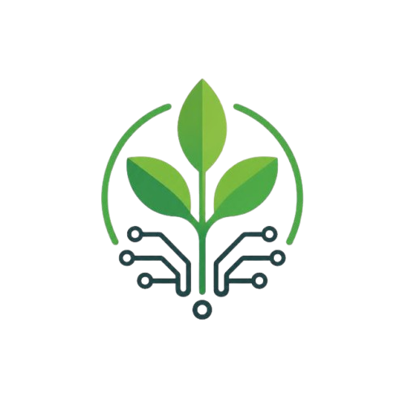

<div align="center">
  
</div>

# TerraMind

Agriculture support assistant with **three comparable AI modes**: product-catalog RAG, general-document RAG, and a base LLM baseline — plus a **React chat UI** with compare view, image upload, and saved conversations.

---

## Documentation

| Document | Description |
|----------|-------------|
| **[PROJECT_OVERVIEW.md](PROJECT_OVERVIEW.md)** | **Main technical guide** — architecture, models, storage, compare, images, APIs |
| **[docs/FILE_MAP_AND_PIPELINE.md](docs/FILE_MAP_AND_PIPELINE.md)** | **File-by-file map** — what runs, what calls what, legacy vs active |
| **[terramind/README.md](terramind/README.md)** | Backend package layout |
| **[docs/RAG_MIGRATION_PLAN.md](docs/RAG_MIGRATION_PLAN.md)** | **Next steps** — split RAG into `terramind/rag/` modules |
| [FrontPage/RUN_LOCALLY.md](FrontPage/RUN_LOCALLY.md) | Run all three services — uses **`<repo-root>`** (your clone path) |
| [FrontPage/ARCHITECTURE.md](FrontPage/ARCHITECTURE.md) | Short architecture diagram |
| [FrontPage/README.md](FrontPage/README.md) | FrontPage API quick start |

---

## Quick start (web MVP)

**Paths:** `<repo-root>` = your TerraMind clone (folder with `Rag_Pc.py` and `FrontPage/`). See [FrontPage/RUN_LOCALLY.md](FrontPage/RUN_LOCALLY.md) for full steps.

### 1. Environment

```powershell
cd <repo-root>
conda create -n terramind python=3.11 -y
conda activate terramind
pip install -r requirements.txt
pip install -r FrontPage/requirements.txt
```

Set `OPENAI_API_KEY` in `<repo-root>/.env` or `FrontPage/.env`.

### 2. Build vector indexes (once)

```powershell
cd <repo-root>
python Rag_Pc.py --reset
python Rag_Gen.py --reset
```

### 3. Run three terminals

```powershell
# Terminal 1 — <repo-root>
cd <repo-root>
uvicorn terramind.api.app:app --reload --port 8001

# Terminal 2 — <repo-root>/FrontPage
cd <repo-root>/FrontPage
uvicorn app.main:app --reload --port 8000

# Terminal 3 — <repo-root>/FrontPage/frontend-react
cd <repo-root>/FrontPage/frontend-react
npm install
npm run dev
```

Open **http://localhost:3000**.

---

## The three models

| Mode | ID | Knowledge source |
|------|-----|------------------|
| Product Catalog RAG | `product_rag` | Client Excel (`ProductCatalog(En).xlsx`) |
| Agriculture Knowledge RAG | `general_rag` | General docs (e.g. FAO pest management markdown) |
| Base LLM | `base_llm` | No retrieval — OpenAI only |

Default LLM: **`gpt-4o-mini`** for chat and vision.

---

## Project layout (high level)

```text
TerraMind/
├── docs/PROJECT_OVERVIEW.md   # Technical introduction
├── terramind/                 # Backend package (API + models + RAG layout)
│   ├── api/app.py             # Model HTTP API (:8001)
│   ├── models/                # Three modes + vision + conversation
│   └── rag/product|general/   # RAG module templates (logic still in Rag_*.py)
├── Rag_Pc.py                  # Product RAG implementation (migrate → terramind/rag/product/)
├── Rag_Gen.py                 # General RAG implementation (migrate → terramind/rag/general/)
├── rag_api.py                 # Shim → terramind.api.app
├── models/                    # Shim → terramind.models (backward compat)
├── vectorstore/               # Chroma indexes (local)
├── data/raw/text/             # Source files
├── FrontPage/                 # Web API (:8000) + React UI (:3000)
├── src/                       # Earlier CLI RAG modules
└── scripts/                   # Ingestion utilities
```

---

## Features (web)

- Model picker (top right) and **Compare all 3** side-by-side
- Plant **image upload** (vision → all modes)
- **Conversation history** in-thread + **localStorage** session restore
- Sources display for RAG answers
- English / Arabic (RTL)

---

## Phase 1 CLI (optional)

Older script-based flow under `scripts/` and `src/`:

```bash
python scripts/01_ingest_documents.py
python scripts/02_create_chunks.py
python scripts/03_build_vectorstore.py
python scripts/05_run_rag.py "Your question"
```

The **recommended demo path** is the FrontPage stack above.

---

## License / context

Bootcamp MVP (RCP #9) — TerraMind focuses on grounded agricultural Q&A with explicit comparison between RAG and non-RAG behavior.
