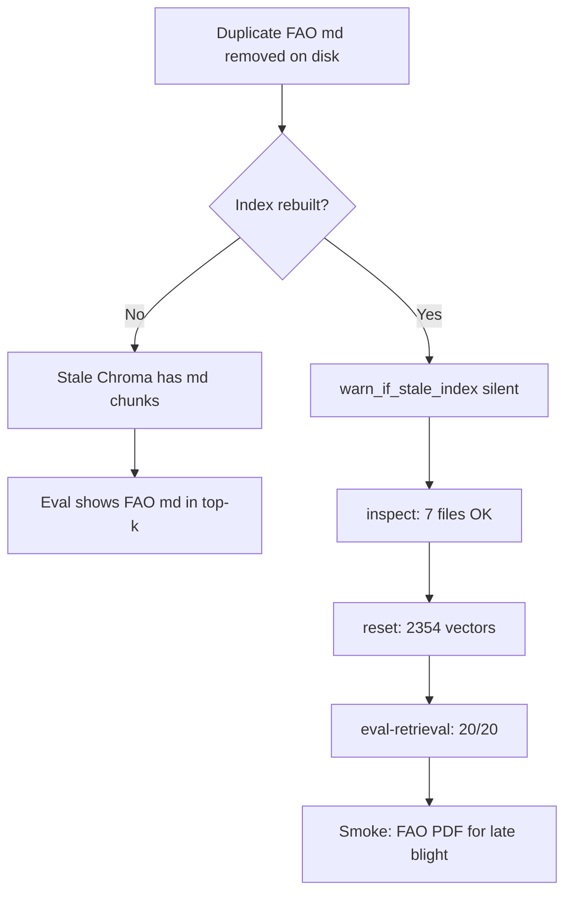

# General RAG — validation report (May 2026)

This document records **what we changed**, **how we verified it**, and **what the CLI runs showed** after rebuilding the general agriculture index. Use it as a baseline when comparing future corpus or retrieval changes.

**Runbook (commands to repeat):** [GENERAL_RAG_EVAL.md](./GENERAL_RAG_EVAL.md)  
**Golden questions:** [`data/eval/general_rag_questions.json`](../data/eval/general_rag_questions.json)  
**Corpus layout:** [GENERAL_RAG_CORPUS.md](./GENERAL_RAG_CORPUS.md)

---

## 1. Summary

| Step | Command | Outcome |
|------|---------|---------|
| Corpus quality | `--inspect` | **7 files**, all **OK** (no low extraction) |
| Index rebuild | `--reset` | **2,354 vectors** (fresh Chroma at `vectorstore/chroma/`) |
| Retrieval regression | `--eval-retrieval` | **20/20 (100%)** — target is ≥ 80% |
| Smoke answer | default CLI question (after `--reset`) | Top-6 chunks all **FAO PDF**; answer cites FAO IPM guidance |

**Conclusion:** After removing the duplicate FAO markdown and rebuilding, the general RAG corpus loads cleanly, the index no longer contains stale `.md` chunks, and retrieval reliably returns the intended source file for each golden question.

---

## 2. What we did (context)

### 2.1 Corpus cleanup

- **Removed** `Pest_Management_FAO.md` from the repo. It duplicated content now covered by **`Pest_Mangment_FAO.pdf`** (filename typo on disk is intentional and mapped in config).
- **Kept** `EXCLUDED_FILENAMES` in `core/rag/general/config.py` so that markdown name is ignored if someone re-adds it under `data/raw/reference_text/`.
- **General RAG package** (`core/rag/general/`) is the active pipeline: load PDFs with `pypdf`, chunk, embed (`text-embedding-3-small`), store in Chroma, retrieve with scored vector search + topic boost + lexical rerank.

### 2.2 Why a rebuild was required

Chroma persists chunks on disk. The **previous** index (~2,876 vectors) still contained embeddings from **`Pest_Management_FAO.md`** even after the file was deleted. Evaluation and chat would keep surfacing `.md` until:

```powershell
python -m core.rag.general.cli --reset
```

`--reset` deletes `vectorstore/chroma/` and re-indexes only what `discover_document_paths()` finds today.

### 2.3 What we did not change in this run

- Product catalog RAG (`vectorstore/chroma_products/`) — separate index.
- Golden question JSON — still expects the PDF filenames listed in section 5.
- Retrieval hyperparameters (`k=6`, `fetch_k=24`, topic map) — unchanged; this run validates them on the new index.

---

## 3. How we verified it (method)

Three CLI steps, in order. No LLM is used for inspect or retrieval eval (cheaper, reproducible).

### Step A — `--inspect` (corpus only)

**Purpose:** Prove each source file extracts enough text **before** paying for embeddings or waiting on a full index build.

**Mechanism:**

- `discover_document_paths()` lists every file that **will** be indexed (7 paths).
- `load_document()` runs the same PDF/text loader used at index time.
- **Pass rule per file:** character count ≥ `INSPECT_MIN_CHARS` (5,000 for PDFs) or ≥ `INSPECT_MIN_CHARS_TEXT` (400 for `.txt`). Status prints `[OK]` or `[LOW]`.

**Does not:** touch Chroma; does not call OpenAI for answers.

### Step B — `--reset` (rebuild index)

**Purpose:** Align on-disk vectors with the current corpus.

**Mechanism:**

- Load 7 documents → chunk → embed → write `vectorstore/chroma/`.
- Prints `Indexed N document(s) -> M chunks` and vector count.
- Optional default test question runs **full RAG** (retrieval + `gpt-4o-mini`) to sanity-check end-to-end.

**Requires:** `OPENAI_API_KEY` for embeddings and the sample answer.

### Step C — `--eval-retrieval` (golden set)

**Purpose:** Regression test **retrieval only** — does the right PDF appear in the top **6** chunks?

**Mechanism:**

- Loads 20 questions from `data/eval/general_rag_questions.json`.
- Each row has `expected_filename` (e.g. `Pest_Mangment_FAO.pdf`).
- `retrieve_chunks()` runs the production retrieval path (same as chat).
- **Pass** if `expected_filename` is in the set of filenames in top-6.
- **Overall pass** if hit rate ≥ **80%** (CLI exit code 1 if below).

**Does not:** judge answer wording quality — only source routing.

---

## 4. Results — corpus inspect (`--inspect`)

**Discovered:** 7 files (6 PDFs under `data/raw/documents/` + `data/sample/pesticide_safety_general.txt`).

| File | Chars extracted | Topic | Inspect |
|------|-----------------|-------|---------|
| `2020-Guide-to-Integrated-Pest-Management.pdf` | 20,815 | `ipm` | OK |
| `Building-Soils-for-Better-Crops.pdf` | 1,281,714 | `soil` | OK |
| `fungicideefficacytiming.pdf` | 225,005 | `fungicide` | OK |
| `Managing pesticides in agriculture and public health.pdf` | 66,935 | `pesticide_policy` | OK |
| `Pest_Mangment_FAO.pdf` | 414,374 | `ipm` | OK |
| `Training manual(GAP).pdf` | 329,161 | `gap` | OK |
| `pesticide_safety_general.txt` | 722 | `safety` | OK |

**Not present:** `Pest_Management_FAO.md` — confirms duplicate removal.

### pypdf warnings on the soil handbook

During load of `Building-Soils-for-Better-Crops.pdf`, the console showed many lines like:

```text
Ignoring wrong pointing object N 0 (offset 0)
```

These come from **pypdf** parsing a large, complex PDF. Extraction still produced **1.28M characters** and inspect marked the file **OK**, so we treated this as **noise, not a failed load**. If soil-specific questions ever miss in eval, consider `pymupdf` / `pdfplumber` for that file only.

---

## 5. Results — index rebuild (`--reset`)

| Metric | Before (stale index, prior session) | After this run |
|--------|-------------------------------------|----------------|
| Vector count | ~2,876 (included `.md` chunks) | **2,354** |
| Documents indexed | 7 + old `.md` chunks | **7** |
| Chunks | — | **2,354** |

The **drop in vector count** is expected: one large duplicate markdown source and its chunks were removed from the corpus.

**Default smoke question** (potato late blight, reduce pesticide use):

- **Retrieval:** all 6 top chunks from `Pest_Mangment_FAO.pdf` (late blight / IDM sections).
- **Generation:** structured IDM steps with citations to “FAO IPM Guidance 2025”.
- **Sources UI label:** FAO IPM Guidance for Major Crop Pests & Diseases (2025).

That confirms PDF-only FAO content is driving both retrieval and answers for a representative advisory-style question.

---

## 6. Results — retrieval eval (`--eval-retrieval`)

**Index loaded:** 2,354 vectors (no stale-index warning — indexed filenames match discovered corpus).

**Hit rate:** **20 / 20 (100%)** — above the **≥ 80%** gate used for regression.

| ID | Topic | Expected file | Result |
|----|-------|---------------|--------|
| ipm-01 | ipm | `2020-Guide-to-Integrated-Pest-Management.pdf` | PASS |
| ipm-02 | ipm | `2020-Guide-to-Integrated-Pest-Management.pdf` | PASS |
| ipm-03 | ipm | `2020-Guide-to-Integrated-Pest-Management.pdf` | PASS |
| fao-01 | ipm | `Pest_Mangment_FAO.pdf` | PASS |
| fao-02 | ipm | `Pest_Mangment_FAO.pdf` | PASS |
| fao-03 | ipm | `Pest_Mangment_FAO.pdf` | PASS |
| fao-04 | ipm | `Pest_Mangment_FAO.pdf` | PASS |
| photo-01 | ipm | `Pest_Mangment_FAO.pdf` | PASS |
| soil-01 … soil-04 | soil | `Building-Soils-for-Better-Crops.pdf` | PASS (×4) |
| gap-01, gap-02 | gap | `Training manual(GAP).pdf` | PASS (×2) |
| fung-01, fung-02 | fungicide | `fungicideefficacytiming.pdf` | PASS (×2) |
| policy-01, policy-02 | pesticide_policy | `Managing pesticides in agriculture and public health.pdf` | PASS (×2) |
| safety-01, safety-02 | safety | `pesticide_safety_general.txt` | PASS (×2) |

### How to read “PASS” when top-3 shows another file

Several passes still show **another manual in rank 2 or 3** (e.g. `ipm-02` has FAO first but Minnesota IPM second; `fao-02` has Minnesota first but FAO in top-6). The eval rule is only: **expected filename appears somewhere in top-6**, not rank-1 only. That is intentional — related IPM docs overlap semantically — but rank-1 purity can be tightened later if product requirements need it.

**Compared to pre-rebuild eval (~85% with `.md` in results):** removing the duplicate and resetting eliminated `.md` from hits and improved the score to **100%** on this golden set.

---

## 7. How we figured this out (reasoning chain)



1. **Hypothesis:** Deleting `.md` is not enough; vectors must be rebuilt.
2. **Check:** `warn_if_stale_index()` (in `eval.py`) lists filenames in Chroma that are not in the current discover list — warned on `Pest_Management_FAO.md` before reset.
3. **Inspect:** Confirms loaders work per file (char thresholds).
4. **Reset:** Rebuild is ground truth for production retrieval.
5. **Eval-retrieval:** Objective pass/fail per topic without LLM variance.
6. **Smoke answer:** Confirms generation + source labels on a real farmer question.

---

## 8. Operational follow-ups

| Action | When |
|--------|------|
| Restart model API (`run_dev.py` / port **8001**) | After `--reset` if the server was already running (in-memory `get_general_db()` cache) |
| Re-run `--inspect` + `--reset` + `--eval-retrieval` | After adding/removing PDFs or changing chunking |
| Re-run `--eval-retrieval` only | After changing `retrieve.py`, topics, or hybrid rerank |
| Update this report | After the next baseline run — add date and hit rate |

---

## 9. Reproduce this baseline

```powershell
cd <repo-root>
conda activate terramind

python -m core.rag.general.cli --inspect
python -m core.rag.general.cli --reset
python -m core.rag.general.cli --eval-retrieval
```

**Environment:** Python 3.11.15 (`terramind` conda env), May 2026 run on Windows. Approximate timings from the session: inspect ~43s (large soil PDF), reset ~2m45s (includes default RAG answer).

---

*Report version: 1.0 — post FAO markdown removal and index rebuild.*
