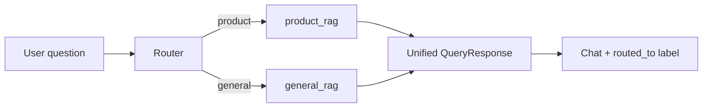

# TerraMind — planned features

**Status:** Auto RAG and retrieval scores are **shipped** (May 2026). Update this file when new roadmap items are added.

---

## 1. Auto RAG mode (intelligent router)

**Status: shipped.** `terramind/models/router.py`, `auto_rag.py`. Default model: `auto_rag`.

### 1.1 Goal

Add **Auto** as the **default** mode in the model picker. The user asks one question; the system **chooses** whether to answer with **Product Catalog RAG** or **Agriculture Knowledge RAG** (or a defined fallback), instead of requiring manual selection.

Manual modes stay available: Product, General, Base LLM, Advisory, Compare.

### 1.2 Intended behavior

| Question type (examples) | Route to |
|--------------------------|----------|
| Product name, dosage, label, “how to apply X”, crops registered, SKU/catalog | `product_rag` |
| IPM, soil health, GAP, rotation, public disease principles, pesticide code/stewardship | `general_rag` |
| Ambiguous / mixed (“late blight and which fungicide from our catalog”) | Policy TBD: **advisory** chain, **general first**, or **LLM router → product** with general context |

**Not in scope for Auto (unchanged):**

- **Compare** — still runs all three models in parallel when enabled.
- **Base LLM** — explicit baseline only; Auto should not silently fall back to ungrounded chat unless router confidence is very low and product policy allows a safe message.

### 1.3 UX

- Dropdown entry: **“Auto (recommended)”** with id e.g. `auto_rag`.
- **Default selection** in `App.jsx`: `auto_rag` instead of `product_rag`.
- After each answer, show **which backend ran** (e.g. chip: “Routed to: Agriculture Knowledge RAG”) so users trust the router.
- User can override anytime by picking Product or General manually.

### 1.4 Technical approach (proposed)



**Router options (pick one or combine in v1):**

1. **Lightweight classifier** — keywords + product-name match against catalog index metadata (fast, no extra LLM call).
2. **Small LLM routing call** — single structured JSON: `{ "route": "product_rag" | "general_rag", "reason": "..." }` using `gpt-4o-mini`.
3. **Dual retrieval probe** — cheap top-1 score from each index; route to higher relevance if margin is clear (needs scores from section 2).

**Registry / API:**

- `terramind/models/__init__.py`: register `auto_rag`; `run_model("auto_rag", …)` runs router then delegates to `product_rag` or `general_rag`.
- Extend response (Model API + FrontPage `AskResponse`):

  | Field | Purpose |
  |-------|---------|
  | `routed_to` | `product_rag` \| `general_rag` |
  | `router_reason` | Optional short string for debug/UI |
  | `system` | e.g. `auto_rag` |

- `GET /models`: include Auto with description; set API `default` to `auto_rag` when shipped.

**Files likely touched:**

- `terramind/models/__init__.py`, new `terramind/models/auto_rag.py` (or `router.py`)
- `terramind/api/app.py` — pass through new fields
- `FrontPage/app/services/rag_service.py`, schemas
- `FrontPage/frontend-react/src/App.jsx` — default model + routed chip
- `docs/SYSTEM_ARCHITECTURE.md` — model table when live

### 1.5 Relation to Advisory

| Mode | Behavior |
|------|----------|
| **Advisory** | Always **both**: general answer, then product with general summary injected |
| **Auto** | **One** RAG backend per question, chosen by router |

Advisory remains for “full stack” questions; Auto is the everyday default.

---

## 2. Retrieval scores and confidence in the UI

**Status: shipped (May 2026).** Backend: `terramind/rag/scoring.py`. UI: sidebar **Show scores**. CLI: `--verbose`.

### 2.1 Goal

Next to **Show sources**, add an option (e.g. **“Show scores”**) that displays:

1. **Answer-level confidence** — already returned as `confidence` (`high` / `medium` / `low`) but not shown prominently today.
2. **Retrieval similarity** — how well the retrieved chunks match the question (vector relevance), aligned with what developers see when running RAG CLIs / standalone scripts separately.

### 2.2 Current state

| Layer | Today |
|-------|--------|
| **API** | `confidence` string on `QueryResponse`; `sources[]` = `{ title, source, section }` only — **no scores** |
| **General retrieve** | MMR + topic boost + lexical rerank (`retrieve.py`) — ranks chunks but **does not attach distance/score** to `Document` metadata |
| **Product retrieve** | `similarity_search` via `Rag_Pc.py` path — scores available from Chroma if using `similarity_search_with_score` |
| **Dev helper** | `terramind/rag/general/evaluate.py` — **pairwise** embedding distance between adjacent chunks (eval tooling), **not** query–chunk relevance |
| **CLI** | `terramind.rag.general.cli` prints chunk previews, not numeric similarity |
| **UI** | `showSrc` checkbox only; no confidence badge |

**Note:** When you run product/general RAG in isolation (legacy scripts or future CLI flags), Chroma can expose **distance** per hit; the **web path** does not forward those numbers yet.

### 2.3 Intended UX

- New checkbox: **“Show scores”** (or combined label: “Show sources & scores”), independent of source chips.
- When on, each assistant message (RAG modes + Auto when routed) shows for example:

  ```
  Confidence: High
  Retrieval: 0.82 (best chunk) · 6 chunks
  ```

- Optional: per-source line under each chip — `similarity: 0.78` for the chunk that backed that source (v2).

- **Compare mode:** per-column scores (three panels).
- **Base LLM:** hide retrieval line; confidence may stay `medium` or N/A.
- **Advisory:** show scores for general and product parts separately (or max of each).

### 2.4 Technical approach (proposed)

**Backend**

1. **Retrieval** — use `similarity_search_with_score` (or LangChain equivalent) at least for the initial vector pool; preserve **best score per chunk** through MMR/rerank (e.g. metadata `relevance_score` normalized 0–1).
2. **Aggregate for answer** — e.g. `retrieval_score` = max or mean of top-k scores; map to confidence bands:

   | Score band | `confidence` |
   |------------|----------------|
   | High relevance + chunks | `high` |
   | Moderate | `medium` |
   | Weak / empty retrieval | `low` |

   Replace or refine today’s rule (`high` if `sources` else `low`).

3. **Sources** — extend `SourceOut` (optional fields):

   | Field | Type | Meaning |
   |-------|------|---------|
   | `relevance_score` | float 0–1 | Best chunk for this source |
   | `chunk_count` | int | Chunks contributing |

4. **API** — top-level on `QueryResponse`:

   | Field | Type |
   |-------|------|
   | `retrieval_score` | float \| null |
   | `confidence` | string (existing, better calibrated) |

**Frontend**

- `App.jsx`: state `showScores`; render near sources footer and in compare panels.
- Format scores as percent or two decimals; tooltip explaining “higher = closer match to your question in the knowledge base”.

**Files likely touched:**

- `terramind/rag/general/retrieve.py`, `terramind/rag/product/` retrieve (when migrated off `Rag_Pc.py`)
- `terramind/rag/source_display.py` — pass scores into source dicts
- `terramind/models/general_rag.py`, `product_rag.py`
- `terramind/api/app.py` — Pydantic models
- `FrontPage/frontend-react/src/App.jsx`
- Optional: CLI `--verbose` prints same scores as UI for parity

### 2.5 Distinction: dev `evaluate.py` vs production scores

| Tool | Measures |
|------|----------|
| `evaluate_chunk_similarity()` | Similarity **between consecutive retrieved chunks** (redundancy check) |
| Production **retrieval_score** | Similarity **query ↔ chunk** used for routing confidence and UI |

Do not conflate the two in docs or UI labels.

---

## 3. Implementation order (suggested)

| Order | Feature | Status |
|-------|---------|--------|
| 1 | **Retrieval scores in API + UI** | Done |
| 2 | **Auto RAG mode** | Done |

---

## 4. Acceptance checks

**Auto** — done

- [x] Default picker = Auto; manual Product/General unchanged
- [x] Router uses dual-index probe + keywords (`tests/test_router.py`)
- [x] UI shows **Routed to:** chip when `auto_rag` or `routed_to` present

**Scores** — done

- [x] Toggle off → sources-only UI unchanged
- [x] Toggle on → confidence + retrieval score for RAG answers
- [x] Compare columns include scores when toggle on
- [x] CLI `--verbose` prints chunk relevance

---

*Last updated: May 2026 — captured from product planning; not yet in codebase.*
