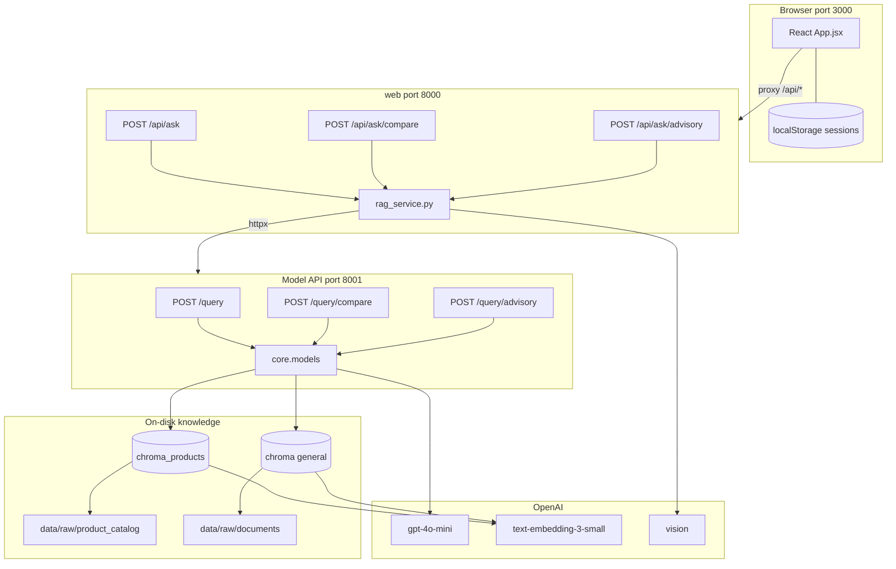

# TerraMind — System Architecture

**Status:** Current as of June 2026. This file is the **canonical architecture reference** — update it when the stack or boundaries change (e.g. after migrations, new services, or deployment).

**Related (not duplicated here):** feature walkthrough → [PROJECT_OVERVIEW.md](../PROJECT_OVERVIEW.md); file-by-file map → [FILE_MAP_AND_PIPELINE.md](./FILE_MAP_AND_PIPELINE.md); **tools & libraries** → [TECH_STACK.md](./TECH_STACK.md); local run → [web/RUN_LOCALLY.md](web/RUN_LOCALLY.md); Docker → [docker/QUICKSTART.md](../docker/QUICKSTART.md).

---

## 1. Purpose

TerraMind is a **multi-mode agriculture assistant**: users ask questions in a web chat, optionally attach crop images, and choose how answers are produced — company product catalog (RAG), public agriculture references (RAG), plain LLM baseline, or a **combined advisory** path (general then product).

Architecture is a **three-process dev stack** (React UI → BFF API → Model API) with **two on-disk vector indexes** and **one shared OpenAI stack** for chat, embeddings, and vision.

---

## 2. Runtime topology

| Layer             | Port | Entry                             | Role                                                                  |
| ----------------- | ---- | --------------------------------- | --------------------------------------------------------------------- |
| **React UI**      | 3000 | `web/frontend-react` (Vite) | Chat, compare grid, model picker, sessions, sources, Markdown answers |
| **web API** | 8000 | `web/app/main.py`           | BFF: vision (optional), proxy to Model API, mock fallback             |
| **Model API**     | 8001 | `core.api.app:app`           | Route to model backends; compare & advisory orchestration             |

**Dev orchestration:** `python run_dev.py` from repo root starts all three.

**Browser → API path:** Vite proxies `/api/*` → `http://localhost:8000`. The UI does not call port 8001 directly in dev.



---

## 3. Request flows

### 3.1 Single model (streaming — default UI)

1. User sends message (+ optional image) from React.
2. `POST /api/ask/stream` → `web/app/services/rag_service.py` → proxies to Model API.
3. If image present: **one** vision call on web before stream starts.
4. `POST http://localhost:8001/query/stream` with `{ question, model, history, image_analysis?, … }`.
5. `core.models.streaming.stream_model_events()` emits **NDJSON**:
   - `{"event":"status","message":"…"}` — routing / retrieval progress
   - `{"event":"token","content":"…"}` — LLM tokens
   - `{"event":"done",…}` — full metadata (`sources`, `routed_to`, `latency_ms`, …)
6. React updates the bot bubble incrementally; finalizes on `done`.

Non-streaming `POST /query` and `POST /api/ask` remain for scripts and integration tests.

### 3.1b Single model (JSON — legacy)

Same as above but waits for one JSON body from `POST /query` / `POST /api/ask`.

### 3.2 Compare (three models in parallel)

1. UI enables Compare → `POST /api/ask/compare`.
2. web runs vision **once**, then `POST /query/compare`.
3. Model API: `asyncio.gather` over `product_rag`, `general_rag`, `base_llm`.
4. UI renders three columns (same question, three answers).

### 3.3 Advisory (general + product)

1. User selects **Advisory** after unlocking it in the UI (logo easter egg — not in public dropdown).
2. `POST /api/ask/advisory/stream` → `POST /query/advisory/stream` → `stream_advisory_events()`.
3. **Sequential:** general RAG stream, then product RAG stream, merged in the final `done` event.
4. **Meta questions** (_who are you_, greetings): short intro only — **no** Chroma retrieval (`core/meta_questions.py`).

Non-streaming `/query/advisory` and `/api/ask/advisory` remain available.

### 3.4 UI startup (bootstrap overlay)

On first load, React shows a full-screen **“Starting TerraMind…”** overlay while it polls **`GET /api/config`** on the gateway (:8000). This is expected when:

- `run_dev.py` starts all three services in parallel (Vite :3000 often wins the race)
- Docker containers are still booting (`gateway` depends on healthy `model-api`)

The overlay retries for up to ~90s, then falls through to the API key gate if the gateway never responds. It is **not** a RAG/index error — rebuild indexes only when retrieval fails after the app is fully loaded.

Implementation: `BootstrapOverlay` in `web/frontend-react/src/App.jsx` (`apiConfigLoading` state).

---

## 4. Model layer

Registry: `core/models/__init__.py` (`MODEL_REGISTRY`, `run_model`, `run_advisory`).

| UI / API `model`         | Backend module                            | Retrieval                                       | Vector store                                               |
| ------------------------ | ----------------------------------------- | ----------------------------------------------- | ---------------------------------------------------------- |
| `auto_rag` (**default**) | `core.models.auto_rag` → `router.py` | One of product, general, or **base LLM**        | Probed both indexes when agronomy-related; meta → base LLM |
| `product_rag`            | `core.models.product_rag`            | Yes — catalog rows                              | `vectorstore/chroma_products/`                             |
| `general_rag`            | `core.models.general_rag`            | Yes — public PDFs + sample text                 | `vectorstore/chroma/`                                      |
| `base_llm`               | `core.models.base_llm`               | No                                              | —                                                          |
| `advisory` (hidden UI)   | `run_advisory` / `stream_advisory_events` | Both RAG chains when needed; meta short-circuit | Both stores                                                |

**Auto routing:** `route_question()` in `router.py` checks **`is_meta_question()`** first → `base_llm` (no retrieval). Otherwise uses dual-index top-1 relevance plus keyword hints → `product_rag` or `general_rag`. Response includes `routed_to` and `router_reason`. Compare mode still runs only the three fixed backends (not Auto).

**Meta detection:** `core/meta_questions.py` — greetings, identity, capability questions (English + some Arabic).

**Shared cross-cutting:**

| Concern                                       | Location                                                       |
| --------------------------------------------- | -------------------------------------------------------------- |
| Chat history in prompts                       | `core/models/conversation.py`                             |
| Meta / identity detection                     | `core/meta_questions.py`                                  |
| Streaming orchestration                       | `core/models/streaming.py`, `core/rag/llm_stream.py` |
| Retrieval vs generation query split (general) | `build_retrieval_query` / `build_prompt_question`              |
| Image context in prompts                      | `core/models/image_context.py`                            |
| Friendly source titles                        | `core/rag/source_display.py`                              |

**LLM defaults:** OpenAI `gpt-4o-mini` (chat), `text-embedding-3-small` (embeddings). Configured via env / RAG config modules.

---

## 5. RAG subsystems

### 5.1 General agriculture RAG (`core/rag/general/`)

**Corpus:** `data/raw/documents/*.pdf`, optional `.md`/`.txt` from `data/raw/reference_text/` (with exclusions), allowlisted sample under `data/sample/`.

**Pipeline:**

```
discover → load (pypdf) → chunk → embed → Chroma
                ↓
         retrieve (MMR + topic boost + lexical rerank)
                ↓
         generate (LangChain + OpenAI)
```

**Index CLI:** `python -m core.rag.general.cli --reset | --inspect | --eval-retrieval`

**Package modules:** `config`, `load`, `chunk`, `store`, `retrieve`, `hybrid`, `topics`, `generate`, `pipeline`, `eval`, `cli`.

### 5.2 Product catalog RAG (`core/rag/product/`)

**Corpus:** Translated Excel catalog in `data/raw/product_catalog/translated/` (`product_catalog_en.xlsx` + `product_categories_en.xlsx`). Original/source workbooks are kept under `data/raw/product_catalog/original/` and are not used at runtime.

**Pipeline:** Excel rows → product documents → chunks → Chroma → hybrid retrieve (dense + BM25 + rerank) → generate. Public API: `core/rag/product/pipeline.py` (`init_product_rag`, `get_product_db`, `answer_with_rag`, streaming helpers).

**Package modules:** `config`, `load`, `chunk`, `store`, `rewrite`, `retrieve`, `hybrid`, `rerank`, `generate`, `pipeline`, `cli`; scaffolds `clarification.py`, `catalog_agent.py` (not wired to routing yet).

**Index:** `python -m core.rag.product.cli --reset` (same command used by Docker `init-indexes`).

### 5.3 Separation of concerns

| Layer      | General                                 | Product                            |
| ---------- | --------------------------------------- | ---------------------------------- |
| Purpose    | Public IPM, GAP, soil, pesticide policy | Company labels, dosage, crops      |
| Index path | `vectorstore/chroma/`                   | `vectorstore/chroma_products/`     |
| Must not   | Invent catalog dosages                  | Replace regulatory public guidance |

---

## 6. Data and persistence

| Store                                               | Scope                                                           | Technology        |
| --------------------------------------------------- | --------------------------------------------------------------- | ----------------- |
| `vectorstore/chroma/`                               | General chunks + metadata (`filename`, `corpus_topic`, headers) | ChromaDB on disk  |
| `vectorstore/chroma_products/`                      | Product row chunks                                              | ChromaDB on disk  |
| `localStorage` (`terramind_sessions_v1`)            | Per-browser chat sessions                                       | Client only       |
| `sessionStorage` (`terramind_advisory_unlocked_v1`) | Hidden Advisory unlock (current tab)                            | Client only       |
| web in-memory history                         | Dev audit log (optional)                                        | Not user sessions |

**Runtime caches:** `get_general_db()` / `get_product_db()` hold in-process Chroma handles; **restart Model API after `--reset`** so indexes reload.

---

## 7. API surface (architecture-relevant)

### Model API (`core/api/app.py`, port 8001)

| Method | Path                     | Behavior                    |
| ------ | ------------------------ | --------------------------- |
| GET    | `/health`                | Status + vector counts      |
| GET    | `/models`                | Registry for UI             |
| POST   | `/query`                 | Single model (JSON)         |
| POST   | `/query/stream`          | Single model NDJSON stream  |
| POST   | `/query/compare`         | Parallel three models       |
| POST   | `/query/advisory`        | General then product (JSON) |
| POST   | `/query/advisory/stream` | Advisory NDJSON stream      |

### web API (port 8000)

| Method | Path                       | Proxies to               |
| ------ | -------------------------- | ------------------------ |
| POST   | `/api/ask`                 | `/query` (JSON)          |
| POST   | `/api/ask/stream`          | `/query/stream`          |
| POST   | `/api/ask/compare`         | `/query/compare`         |
| POST   | `/api/ask/advisory`        | `/query/advisory`        |
| POST   | `/api/ask/advisory/stream` | `/query/advisory/stream` |
| GET    | `/api/models`              | `/models`                |

Config: `RAG_SERVICE_URL` (default `http://localhost:8001/query`), `USE_MOCK` for offline UI.

---

## 8. Repository layout (logical)

```
<repo-root>/
├── web/
│   ├── app/                 # FastAPI BFF (8000)
│   └── frontend-react/      # React + Vite (3000)
├── core/
│   ├── api/app.py           # Model API (8001)
│   ├── models/              # Per-mode adapters, advisory, streaming, vision
│   ├── meta_questions.py    # Meta / identity detection (Auto + Advisory)
│   └── rag/
│       ├── general/         # Public docs RAG (active)
│       ├── product/         # Catalog RAG (active)
│       └── source_display.py
├── data/
│   ├── raw/documents/       # General PDF corpus
│   ├── raw/product_catalog/ # Product Excel (translated + original/source)
│   ├── raw/reference_text/  # Optional general text references
│   ├── sample/              # Allowlisted short references
│   └── eval/                # Retrieval golden set
├── vectorstore/             # Chroma persistence (gitignored)
├── docs/                    # Developer docs (this file)
├── run_dev.py               # Start 8001 + 8000 + 3000
└── run_dev.py               # Start 8001 + 8000 + 3000
```

---

## 9. Technology stack

Full inventory — purpose, version source, and **where in the repo each tool runs** (APIs, RAG, UI, Docker, tests):

→ **[TECH_STACK.md](./TECH_STACK.md)**

**Summary (runtime):**

| Layer | Primary tools |
| --- | --- |
| APIs | FastAPI, Uvicorn, httpx (BFF proxy) |
| LLM / vision | OpenAI (`gpt-4o-mini`, `text-embedding-3-small`) via LangChain |
| Indexes | ChromaDB on disk (`vectorstore/` or Docker volume `terramind-vectorstore`) |
| General RAG | pypdf → chunk → embed → retrieve (+ lexical rerank in `hybrid.py`) |
| Product RAG | pandas/openpyxl → chunk → embed; **BM25** + dense hybrid; **CrossEncoder** rerank |
| UI | React, Vite (dev); nginx (Docker production) |
| Deploy | Docker Compose — three services; `data/` bind-mount, indexes in named volume |

Secrets: repo-root `.env` (`OPENAI_API_KEY`, optional `RAG_SERVICE_URL` for local gateway). Not baked into images.

---

## 10. Planned evolution (not current)

**Status, legacy, and roadmap:** [PROJECT_STATUS.md](./PROJECT_STATUS.md)

| Feature                | Summary                                                                                  |
| ---------------------- | ---------------------------------------------------------------------------------------- |
| **Auto RAG mode**      | **Shipped** — routes to product, general, or **base LLM**; meta questions skip retrieval |
| **Streaming chat**     | **Shipped** — NDJSON `/query/stream`; UI uses `/api/ask/stream`                          |
| **Hidden Advisory UI** | **Shipped** — 6× logo click unlock; `/query/advisory/stream`                             |
| **Scores in UI**       | **Shipped** — “Show scores” toggle; `retrieval_score` + `confidence`                     |
| Product catalog tools   | Clarification classifier and SQL-like catalog agent scaffolds exist; implementation pending |
| Deployment             | Not defined in repo yet                                                                  |
| PDF extraction         | Optional `pymupdf` — see GENERAL_RAG_EVAL runbook                                        |

---

## 11. How to update this document

When architecture changes (new service, port, model mode, index layout, or advisory flow):

1. Edit **this file** only for structure/topology/contracts.
2. Keep feature-level narrative in `PROJECT_OVERVIEW.md`.
3. Keep file-level inventory in `FILE_MAP_AND_PIPELINE.md`.
4. Keep libraries and logos in `TECH_STACK.md` when dependencies change.
5. Note the date or PR in the **Status** line at the top if helpful.
